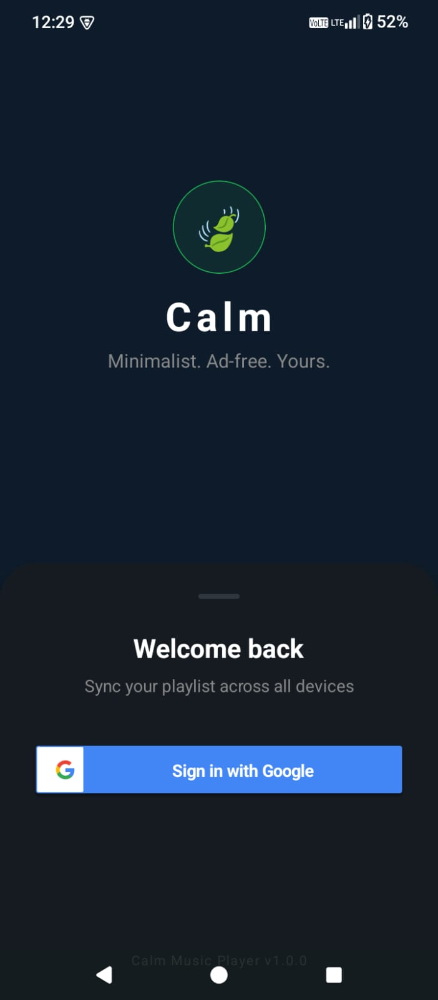
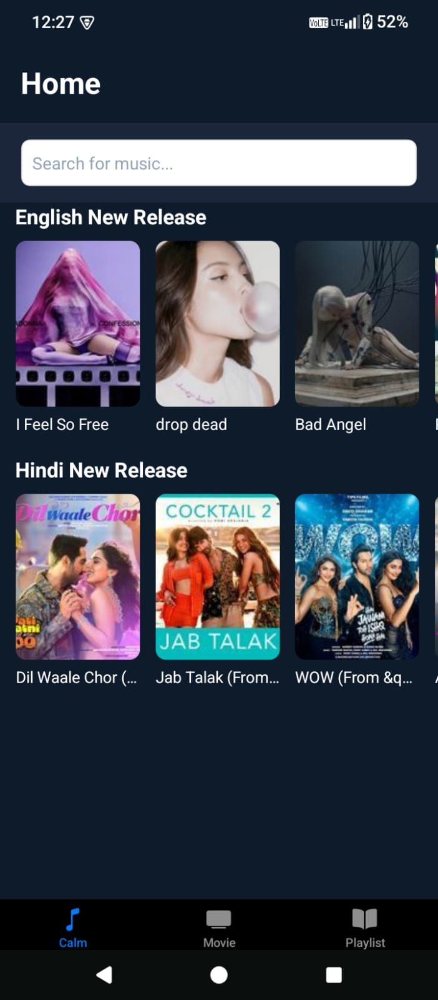
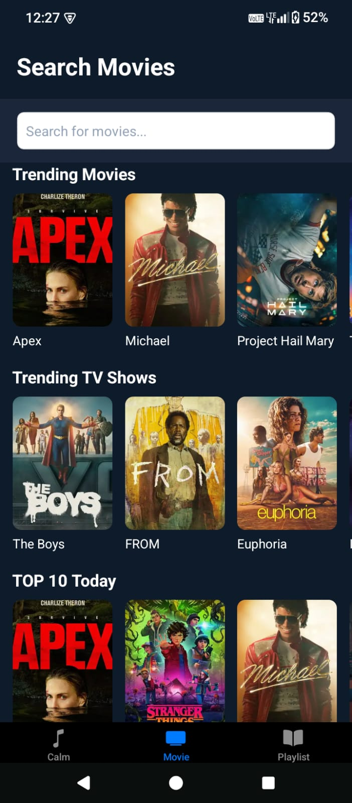
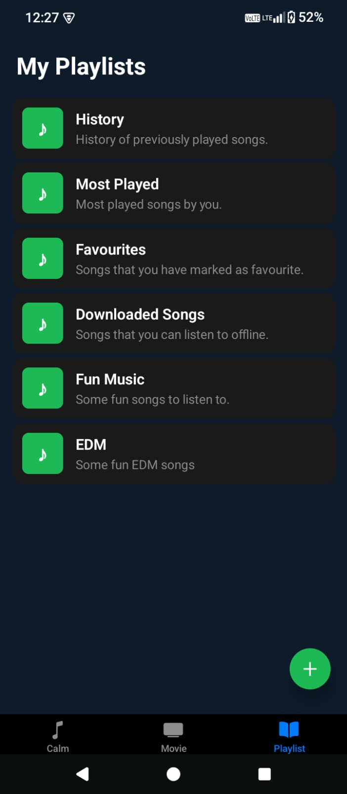

# Calm
## Unlimited movies and music, zero ads, zero interruptions—just pure entertainment, free.

## Download our android app now: [Android](https://github.com/saket-shetty/Calm/raw/master/android/app/build/outputs/apk/release/app-release.apk)

<table>
  <tr>
    <td></td>
     <td></td>
     <td></td>
  </tr>
    <tr>
     <td></td>
     <td></td>
   </tr>
</table>

## To work with the codebase follow the below steps 

1. Install dependencies

   ```bash
   npm install
   ```

2. Start the app

   ```bash
   npm run android
   ```